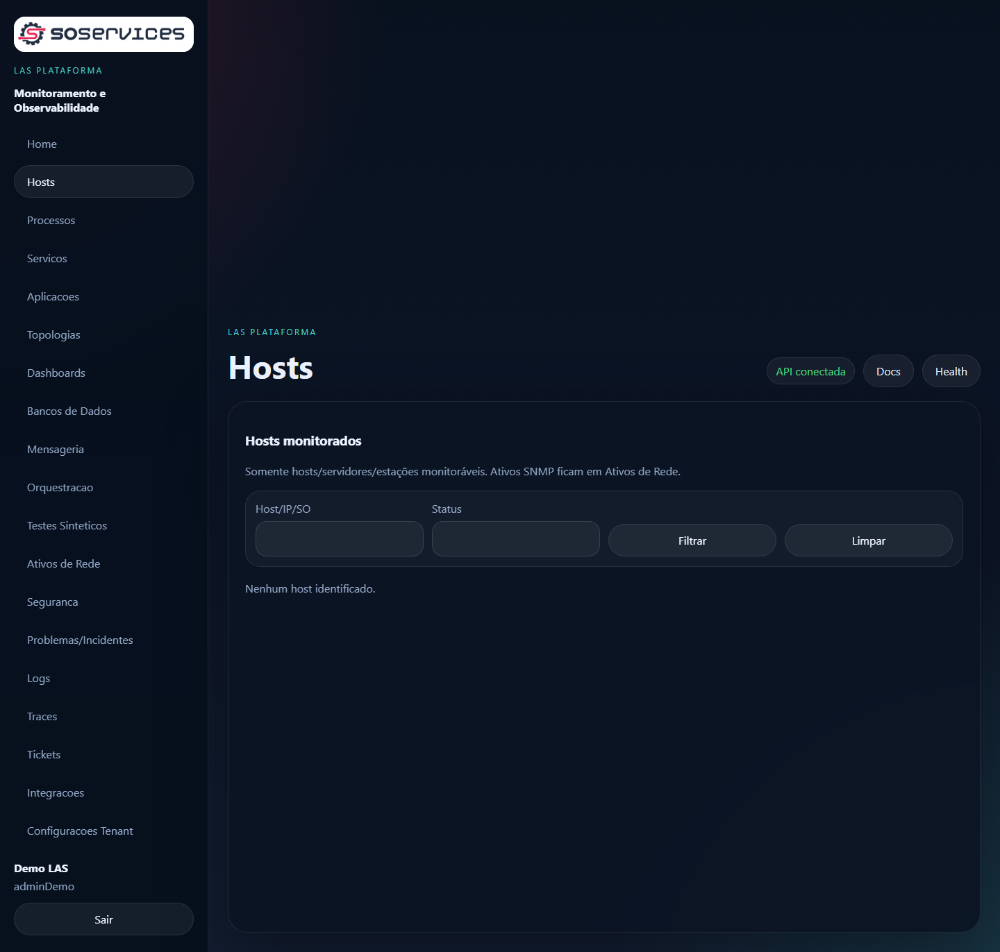
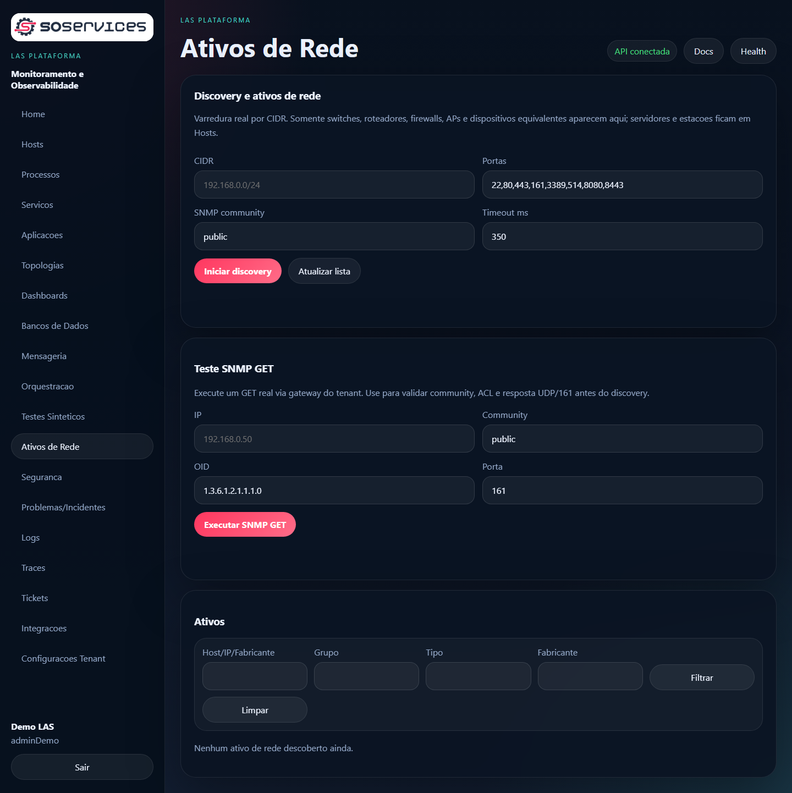
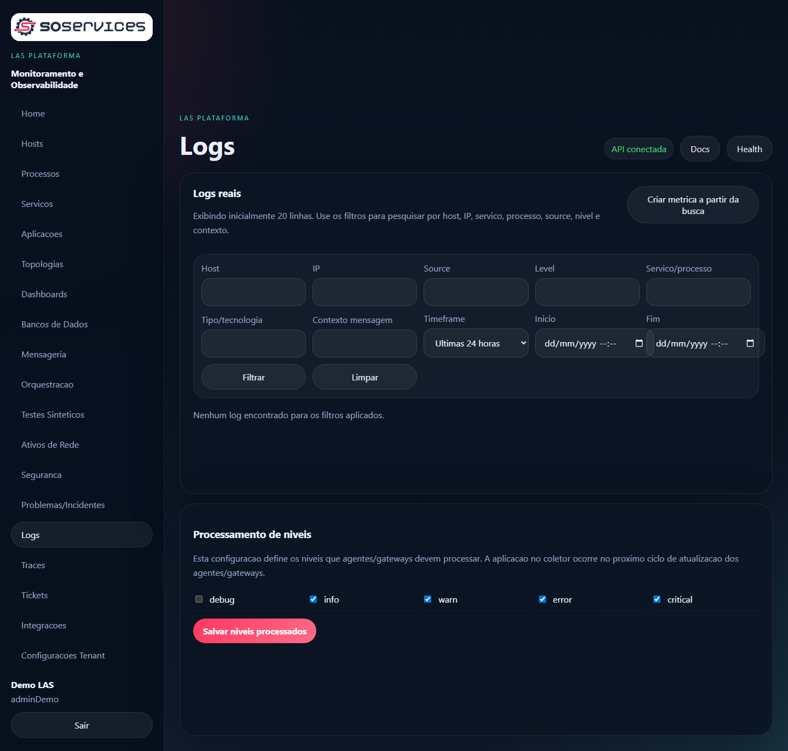
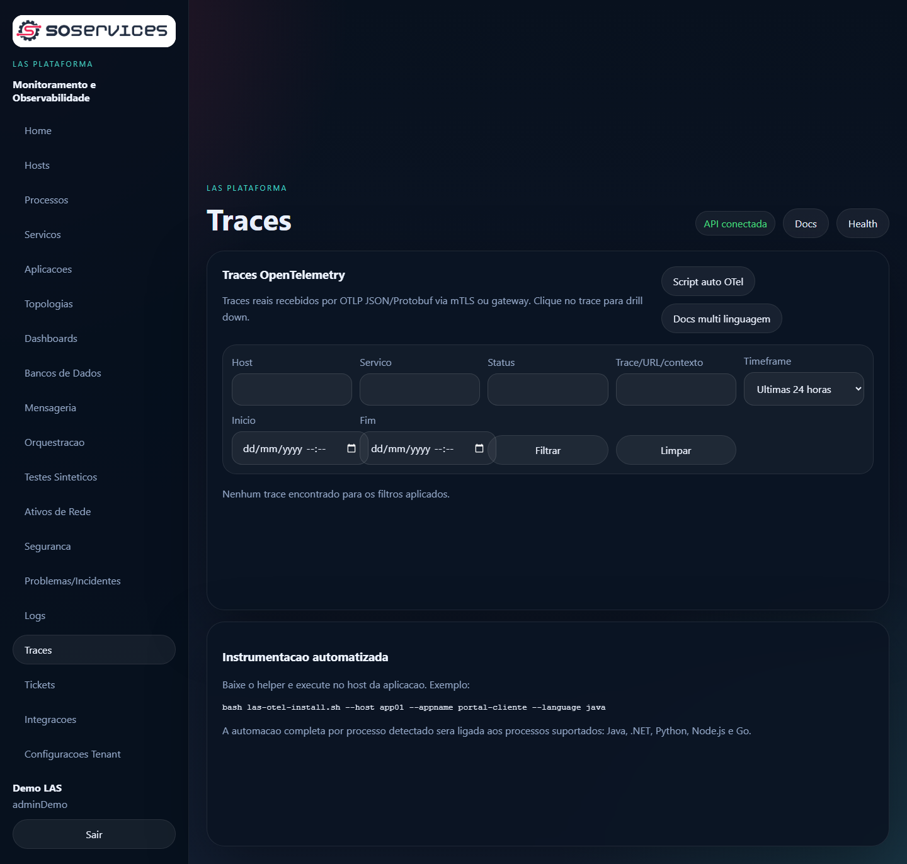
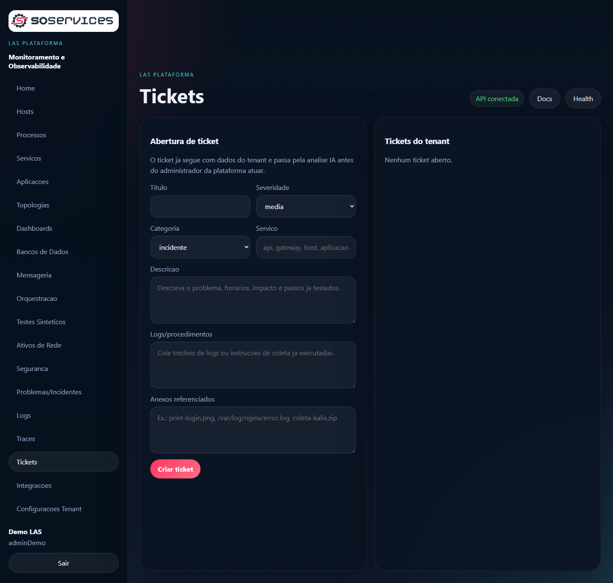

# LAS Plataforma de Monitoramento e Observabilidade
Apresentacao comercial (base) para clientes.

> Observacao: este material descreve o que a plataforma ja suporta conforme documentacao tecnica do repositorio. Itens futuros ficam explicitamente em "Roadmap" para evitar promessas indevidas.

---

## Slide 1. Titulo
**LAS Plataforma de Monitoramento e Observabilidade**  
Infraestrutura, logs, observabilidade e redes, com implantacao SaaS ou on-prem.

[Inserir logo: `frontend/public/assets/soservices-logo.png`]

---

## Slide 2. O problema (dores reais)
- Ambientes hibridos e segmentados (sem internet nos hosts) dificultam agentes e coleta.
- Falta de correlacao entre incidentes, logs, traces e processos aumenta MTTR.
- Inventario de rede incompleto (ativos e hosts descobertos) vira "caixa preta".
- Coleta e operacao sem padrao (instalacao manual, secrets espalhados, sem mTLS).

---

## Slide 3. O que e o LAS
O LAS e uma plataforma de monitoramento e observabilidade focada em:
- **Infra**: CPU, memoria, disco, rede e processos.
- **Logs**: ingestao por agente, gateway e syslog remoto, com pesquisa e filtros.
- **Observabilidade (OTel)**: traces e metricas com drill down.
- **Redes**: discovery + SNMP, inventario e status de interfaces.
- **Operacao**: gateways com cluster/failover por tenant, batching/compressao e mTLS.

---

## Slide 4. Diferenciais
- **mTLS obrigatorio** para agentes e gateways (criptografia + autenticacao).
- **Gateway por tenant** para operar dentro da rede do cliente (discovery/SNMP/syslog/ingest).
- **Cluster e failover** de gateways (prioridade e peso) e rotas de fallback direto para SaaS.
- **Artefatos centralizados**: instaladores, manifests e scripts podem ser servidos pelo SaaS ou espelhados por um gateway (cache/mirror).
- **Licenciamento por modulos** (entitlements), liberando capacidades por necessidade.

---

## Slide 5. Arquitetura (visao)
```mermaid
flowchart LR
  U[Usuario] -->|https| RP[Reverse proxy / Ingress]
  RP -->|/| FE[Frontend (las.<dominio>)]
  RP -->|/api| API[API (api.<dominio>)]

  subgraph Cliente
    A[Agentes] -->|mTLS| GW[Gateway do tenant]
    SYS[Syslog TCP/UDP 514] --> GW
    GW -->|mTLS| API
    A -->|mTLS (fallback)| API
    GW -->|discovery/SNMP/syslog| NET[Hosts e Ativos]
  end
```

Notas de fala:
- O usuario acessa `las.<dominio>`; a API fica em `api.<dominio>`.
- Agentes preferem gateway; sem gateway, fazem fallback direto para o SaaS/API.
- Em redes segmentadas, o gateway roda "dentro" e entrega discovery/SNMP e ingest.

---

## Slide 6. Segurança: mTLS end-to-end
- Rotas operacionais usam **mTLS** (client cert) para autenticar e criptografar trafego.
- Bootstrap inicial ocorre via endpoint de bundle (TLS normal) e depois segue mTLS.
- Recomendacao: separar DNS/rotas `api.<dominio>` (publico) e `mtls-api.<dominio>` (restrito), quando fizer sentido no ambiente.

---

## Slide 7. Monitoramento de hosts (infra)
- Heartbeat e cadastro automatico de hosts (Linux/Windows).
- Metricas reais: CPU, memoria, disco, rede e **processos**.
- Detalhes por host (status, modo de monitoramento, consumo por recurso).



[Pendente: screenshot detalhes do host (com dados reais de CPU/RAM/Disco/Rede, processos e logs)]

---

## Slide 8. Redes: discovery + SNMP + inventario
- Discovery de rede despachado para um gateway online do tenant.
- Agrupamento de entidades:
  - `net_discovered`: descobertos por scan.
  - `net_w_snmp`: SNMP ativo, enriquecidos por coleta.
- Coleta SNMP: fabricante, modelo, OS/firmware, interfaces, erros, throughput.



---

## Slide 9. Logs: centralizacao e pesquisa
- Ingestao via agentes, gateways e syslog remoto.
- Filtros por host, IP, processo, aplicacao, nivel, origem e texto.
- Correlacao por `trace_id` quando o log vier de requisicoes instrumentadas.



---

## Slide 10. Observabilidade (OpenTelemetry)
- Ingestao de traces e metricas via OTel.
- Drill down por servico, host, URL, metodo, status, duracao e dependencias.
- Correlacao entre processos, logs, traces e servicos consumidos.



---

## Slide 11. Gateways: cluster, failover e performance
- Registro e heartbeat.
- Cluster por tenant com prioridade e peso.
- Encaminhamento de lotes reais (logs/metricas/traces/syslog/discovery).
- Padrao de operacao: compressao/batching e rotas protegidas por mTLS.

---

## Slide 12. Implantacao (SaaS e on-prem)
Modos suportados:
- **Orquestracao**: Docker Compose e Kubernetes.
- **On-prem**: ambiente operado pelo cliente (com HA recomendado).
- **Artefatos**: instaladores e manifests servidos pelo SaaS e/ou por gateway (mirror).

Itens de infraestrutura tipicos:
- Reverse proxy/Ingress (Nginx Proxy Manager, Nginx, Caddy, Ingress).
- Banco e cache com persistencia (Postgres/Redis).
- HA: 2+ instancias de API + estrategia de failover para dados.

---

## Slide 13. Licenciamento (como vender)
Licencas por modulo (entitlements), por exemplo:
- `infra` (infra + processos + servicos + logs)
- `complete` (OTel/traces/APM)
- `user_experience` (RUM/DEM)
- `sec` (IDS e tarefas de seguranca)
- `network_discovery` (scan/discovery via gateway)
- `integrations` (extensoes/plugins e conectores)
- `snmp_logs` (SNMP + syslog/logs remotos)

---

## Slide 14. Suporte ao cliente (tickets + IA)
- Ticket por tenant (cliente abre no portal do proprio tenant).
- Administrador acompanha status, interacoes e anexos.
- Triagem inicial automatizada com IA para sugerir caminhos de resolucao.



---

## Slide 15. Roadmap (proximos blocos)
Itens planejados (visao de produto):
- RUM completo (sessoes, tempos de acao e correlacao com servicos).
- Synthetic monitoring avancado (timings, baseline e alertas).
- Extensoes/plugins: banco de dados (query personalizada -> metrica), ITSM, webhooks e etc.
- Topologias graficas (rede, processos, servicos, aplicacoes).
- Empacotamento final (obfuscacao/assinatura, auto-update, installers).

---

## Slide 16. Encerramento / Call to action
- Oferecer trial (ex.: 15 dias) com onboarding guiado (gateway + 1 agente + 1 app OTel).
- Entregaveis do piloto: inventario de hosts, logs centralizados e traces correlacionados.

Contato e proximos passos:
- Workshop de 60 min para topologia e requisitos (DNS, proxy, redes, politicas).
